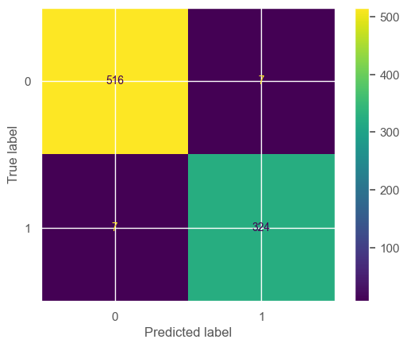

# Loan Approval Prediction
Jupyter notebook to demonstrate a supervised learning model based on loan approval dataset available on [kaggle](https://www.kaggle.com/datasets/architsharma01/loan-approval-prediction-dataset).

## Classifiers used
The following classifiers were considered for this demonstration:
- LogisticRegression
- Support Vector Classification
- KNeighborsClassifier
- DecisionTreeClassifier
- RandomForestClassifier
- AdaBoostClassifier
- SGDClassifier
- XGBClassifier

## Each Classifier performance
|         Model          | Training Score | Accuracy | AUC-ROC | AUC-PR |
|:----------------------:|:--------------:|:--------:|:-------:|:------:|
|   LogisticRegression   |     91.33%     |  92.39%  |  0.919  | 0.9213 |
|          SVC           |     94.82%     |  95.67%  |  0.9546 | 0.9547 |
|  KNeighborsClassifier  |     92.42%     |  94.03%  |  0.9368 | 0.9381 |
| DecisionTreeClassifier |     97.6%      |  97.66%  |  0.9737 | 0.9772 |
| RandomForestClassifier |     98.16%     |  98.24%  |  0.9807 | 0.9825 |
|   AdaBoostClassifier   |     96.9%      |  97.07%  |  0.9711 | 0.968  |
|     SGDClassifier      |     91.51%     |  92.86%  |  0.9378 | 0.9221 |
|     XGBClassifier      |     98.51%     |  98.95%  |  0.9881 | 0.9899 |

## Hyperparameter tuning
RFClassifier was considered to demonstrate hypertuning using `RandomizedSearchCV`. `RandomizedSearchCV` is a technqiue used for hyperparameter tuning. It randomnly picks hyperparameters and tries out various combinations and conducts cross validations over the dataset to evaluate the model accuracy.

After passing parameters to `RFClassifier`
```
------------------------------------------------------------------------------------------
RandomForestClassifier: Training classifier....
RandomForestClassifier: has a training score of 98.27%
RandomForestClassifier Testing classifier...
RandomForestClassifier: Area Under the Receiver Operating Characteristic: 0.9827
RandomForestClassifier: Area Under the Precision-Recall : 0.983
RandomForestClassifier: RandomForestClassifier has Accuracy : 98.36%
------------------------------------------------------------------------------------------
```

### Confusion Matrix
